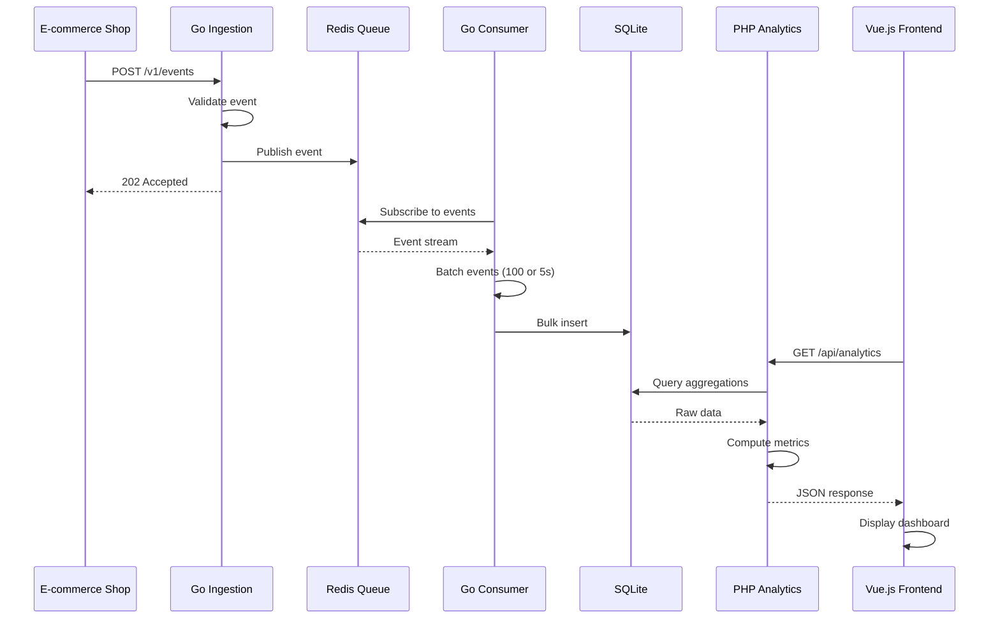

# Architecture Documentation

## System Overview

This analytics pipeline follows an **event-driven architecture** pattern with clear separation of concerns across four main services.

## Request Flow



## Component Responsibilities

### 1. Go Ingestion Service

**Port**: 8080
**Technology**: Go, Gin framework, Redis client

**Responsibilities**:
- Receive HTTP POST requests with event data
- Validate JSON schema and event types
- Publish valid events to Redis queue
- Return immediate 202 Accepted response

**Why Go?**
- Excellent concurrency model for handling high request volumes
- Low latency response times
- Lightweight and fast

**Endpoints**:
- `POST /v1/events` - Submit tracking event
- `GET /v1/health` - Health check

### 2. Redis Queue

**Port**: 6379
**Technology**: Redis Pub/Sub

**Responsibilities**:
- Act as message broker between ingestion and processing
- Buffer events during traffic spikes
- Enable asynchronous processing

**Why Redis?**
- Simple setup for demo purposes
- Fast in-memory operations
- Built-in Pub/Sub capabilities

**Production Alternative**: Kafka or AWS Kinesis for durability and replay capabilities

### 3. Go Consumer Service

**Technology**: Go, Redis subscriber, SQLite driver

**Responsibilities**:
- Subscribe to Redis events channel
- Batch events (100 events or 5-second intervals)
- Bulk insert into SQLite database
- Handle graceful shutdown with final flush

**Why Go?**
- Efficient background processing
- Native goroutines for concurrent operations
- Same codebase as ingestion (shared models)

**Batch Strategy**:
```
Flush when:
- Batch size ≥ 100 events, OR
- 5 seconds elapsed since last flush
```

### 4. PHP Analytics Service

**Port**: 8000
**Technology**: PHP 8.2, Symfony 6.4, PDO

**Responsibilities**:
- Query event data from SQLite
- Compute analytics metrics:
  - Event counts by type
  - Conversion rate calculations
  - Purchase statistics (avg, min, max)
  - Top product identification
- Serve JSON API to frontend

**Why PHP/Symfony?**
- Matches Shopware's technology stack
- Rich ecosystem for business logic
- Clear separation from event processing layer

**Endpoints**:
- `GET /api/analytics` - Get aggregated metrics
- `GET /api/health` - Health check

### 5. SQLite Database

**Location**: `./data/analytics.db`

**Schema**:
```sql
CREATE TABLE events (
    id INTEGER PRIMARY KEY AUTOINCREMENT,
    event_type TEXT NOT NULL,
    timestamp DATETIME NOT NULL,
    product_id TEXT,
    order_amount REAL,
    created_at DATETIME DEFAULT CURRENT_TIMESTAMP
);

CREATE INDEX idx_event_type ON events(event_type);
CREATE INDEX idx_timestamp ON events(timestamp);
CREATE INDEX idx_product_id ON events(product_id);
```

**Why SQLite?**
- Zero configuration for local development
- Single file database
- Sufficient for demo workload

**Production Alternative**: PostgreSQL or MySQL for concurrent access and scalability

### 6. Vue.js Frontend

**Port**: 3000
**Technology**: Vue 3, Vite

**Responsibilities**:
- Fetch analytics data from PHP API
- Display metrics in dashboard cards
- Auto-refresh every 5 seconds
- Handle loading and error states

**Why Vue.js?**
- Lightweight and reactive
- Simple component model
- Matches job requirements

## Data Flow

### Ingestion Path (Write)
```
E-commerce Event → Go Ingestion → Redis → Go Consumer → SQLite
```

**Characteristics**:
- **Asynchronous**: Immediate response to client
- **Buffered**: Redis handles traffic spikes
- **Batched**: Efficient database writes

### Analytics Path (Read)
```
Frontend → PHP Analytics → SQLite → Computed Metrics → JSON Response
```

**Characteristics**:
- **On-demand**: Computed when requested
- **No caching**: Simple implementation (would add Redis cache in production)
- **Eventual consistency**: May lag 1-5 seconds behind writes

## Scalability Architecture

### Current Limitations
- Single ingestion instance
- Single consumer instance
- SQLite limited to ~1000 writes/second
- No caching layer

### Production Scaling Strategy

```
                     ┌─────────────────┐
                     │  Load Balancer  │
                     └────────┬────────┘
                              │
              ┌───────────────┼───────────────┐
              ▼               ▼               ▼
         ┌────────┐      ┌────────┐      ┌────────┐
         │Ingest 1│      │Ingest 2│      │Ingest N│
         └────┬───┘      └────┬───┘      └────┬───┘
              │               │               │
              └───────────────┼───────────────┘
                              ▼
                    ┌──────────────────┐
                    │  Kafka Cluster   │
                    │  (3 partitions)  │
                    └─────────┬────────┘
                              │
              ┌───────────────┼───────────────┐
              ▼               ▼               ▼
       ┌──────────┐    ┌──────────┐    ┌──────────┐
       │Consumer 1│    │Consumer 2│    │Consumer 3│
       └─────┬────┘    └─────┬────┘    └─────┬────┘
             │               │               │
             └───────────────┼───────────────┘
                             ▼
                   ┌──────────────────┐
                   │   PostgreSQL     │
                   │  (Read Replicas) │
                   └─────────┬────────┘
                             │
                    ┌────────┴────────┐
                    ▼                 ▼
             ┌──────────┐      ┌──────────┐
             │Analytics │      │Analytics │
             │   API 1  │      │   API 2  │
             └──────────┘      └──────────┘
```

**Improvements**:
1. **Horizontal scaling**: Multiple instances of each service
2. **Persistent queue**: Kafka with partitions for parallelism
3. **Read replicas**: Separate read/write databases
4. **Caching**: Redis for frequently accessed metrics
5. **Load balancing**: Distribute traffic across instances

## Technology Choices Summary

| Component | Technology | Reason |
|-----------|-----------|--------|
| Ingestion | Go + Gin | High concurrency, low latency |
| Queue | Redis Pub/Sub | Simple, fast, easy setup |
| Consumer | Go | Background processing, shared models |
| Analytics | PHP + Symfony | Business logic, stack alignment |
| Database | SQLite | Local dev simplicity |
| Frontend | Vue.js | Reactive, lightweight |
| Orchestration | Docker Compose | Multi-service local development |

## Event Schema Design

### Event Types
1. **page_view**: User views a product page
2. **add_to_cart**: User adds product to cart
3. **purchase**: User completes order

### Required Fields
- `event_type`: One of the three valid types
- `timestamp`: ISO 8601 datetime in UTC

### Optional Fields
- `product_id`: Product identifier (recommended for all events)
- `order_amount`: Purchase value (required for purchase events)

### Validation Rules
- Event type must be one of: `page_view`, `add_to_cart`, `purchase`
- Timestamp must be valid ISO 8601 format
- Order amount must be present for purchase events
- Product ID recommended for meaningful analytics

## Metrics Computation

### Total Counts
```sql
SELECT event_type, COUNT(*) as count
FROM events
GROUP BY event_type
```

### Conversion Rate
```
(total_purchases / total_page_views) * 100
```

### Purchase Statistics
```sql
SELECT
    AVG(order_amount) as avg,
    MAX(order_amount) as max,
    MIN(order_amount) as min
FROM events
WHERE event_type = 'purchase' AND order_amount IS NOT NULL
```

### Top Product (Most Viewed)
```sql
SELECT product_id, COUNT(*) as view_count
FROM events
WHERE event_type = 'page_view' AND product_id IS NOT NULL
GROUP BY product_id
ORDER BY view_count DESC
LIMIT 1
```

## Error Handling

### Ingestion Service
- **Invalid JSON**: 400 Bad Request
- **Invalid event type**: 400 Bad Request
- **Redis unavailable**: 500 Internal Server Error

### Consumer Service
- **Redis connection lost**: Retry with exponential backoff
- **Database write failure**: Rollback transaction, log error
- **Graceful shutdown**: Flush remaining batch before exit

### Analytics Service
- **Database unavailable**: 500 Internal Server Error
- **Empty result set**: Return zeros for all metrics

## Monitoring & Observability

### Health Checks
- `GET /v1/health` - Ingestion service status
- `GET /api/health` - Analytics service status

### Logging
- Structured JSON logs in all services
- Request/response logging
- Error stack traces
- Batch flush events

### Future Enhancements
- Prometheus metrics export
- Distributed tracing (Jaeger/Zipkin)
- Centralized logging (ELK stack)
- Custom dashboards (Grafana)

## Security Considerations

### Current Implementation
- **No authentication**: Demo purposes only
- **No rate limiting**: Unbounded request acceptance
- **No encryption**: HTTP only

### Production Requirements
1. **API Authentication**: API keys or JWT tokens
2. **TLS/HTTPS**: Encrypted communication
3. **Rate Limiting**: Per-client request throttling
4. **Input Validation**: Strict schema validation
5. **CORS Configuration**: Restrict frontend origins
6. **Secrets Management**: Environment variables or vault
7. **PII Anonymization**: Hash or truncate sensitive data

## Deployment

### Local Development
```bash
docker-compose up -d
```

### Production (AWS Example)
- **Ingestion**: ECS Fargate (auto-scaling)
- **Queue**: Amazon MSK (Managed Kafka)
- **Consumer**: ECS Fargate (auto-scaling)
- **Database**: RDS PostgreSQL
- **Analytics**: ECS Fargate or Lambda
- **Frontend**: S3 + CloudFront

See `/docs/aws-deployment.md` for detailed architecture.

## Testing Strategy

### Unit Tests
- Go: Handler validation logic
- PHP: Metrics calculation service

### Integration Tests
- End-to-end event submission → analytics retrieval
- Database query correctness
- API response format validation

### Load Tests
- Ingestion throughput (events/second)
- Consumer batch processing efficiency
- Database query performance

## Future Enhancements

1. **Real-time streaming**: WebSocket updates to frontend
2. **Time-series analytics**: Hourly/daily aggregations
3. **User session tracking**: Conversion funnel analysis
4. **Data warehouse**: ClickHouse for historical queries
5. **Machine learning**: Predictive analytics
6. **Multi-tenancy**: Shop-level data isolation
